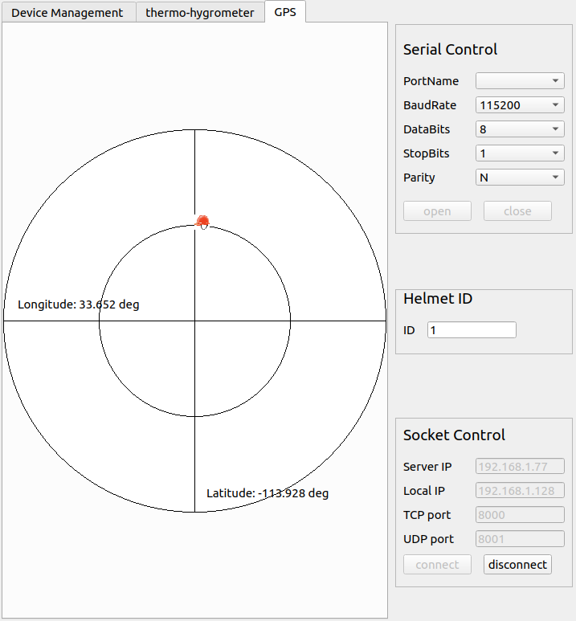
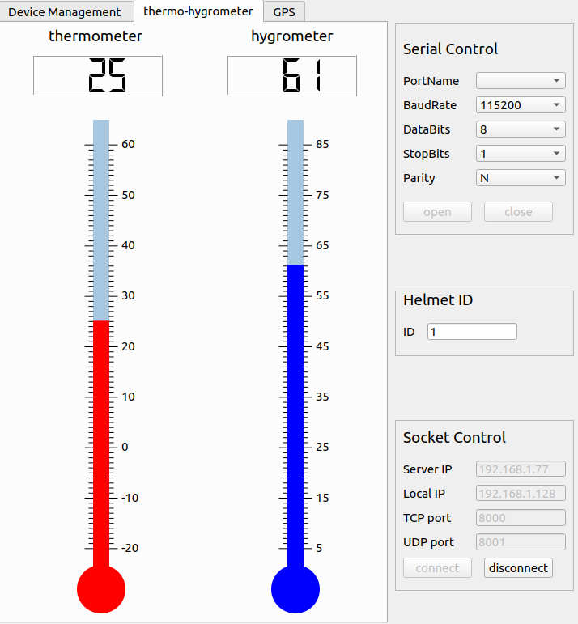
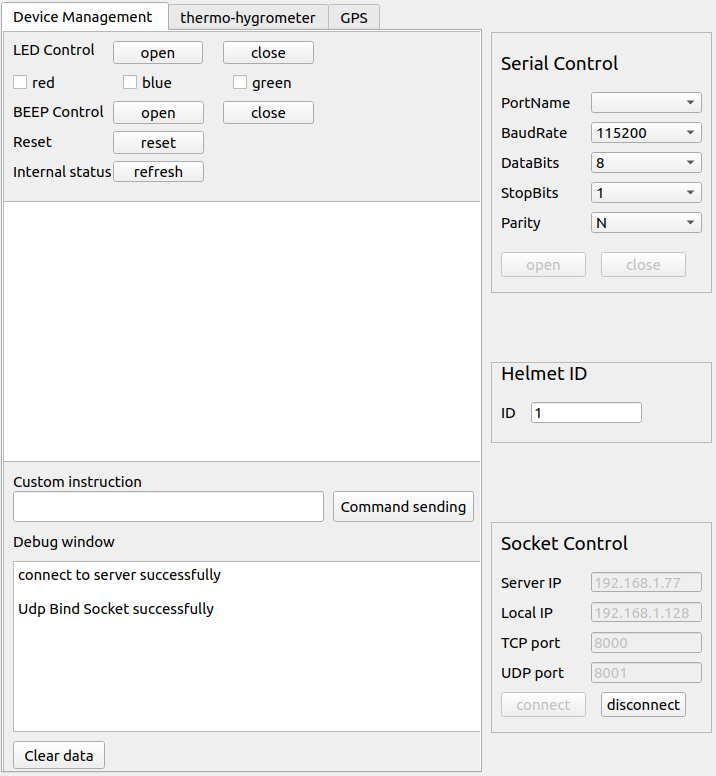

    这是一个基于i.MX6ULL与linux设计的工厂工人智能安全头盔管理系统，包含上位机与下位机。

主要涉及的技术包含`QT/C++`、`TCP`、`UDP多播`、`内核模块`、`设备树插件`、`智能指针`、`多线程管理`等技术，可以作为嵌入式/linux开发学习者入手的一个综合项目。

此项目完成的功能将在后续进行介绍，作者也会在后续不断加入新的功能。

此项目仓库包含以下内容:

- [Background](#background)
- [Install](#install)
    - [开发环境](#开发环境)
    - [环境配置](#环境配置)
- [Usage](#usage)
- [Maintainers](#maintainers)
- [Contributing](#contributing)
- [License](#license)

## Background

化工场工人的安全问题是一个值得关注的问题，为了提高工人的安全保障，本项目设计了一款用于工厂放毒气安全头盔系统。基于 ARM Cortex-A7 处理器 i.MX6ULL 开发具有温湿度和气体浓度检测、GPS 定位的工厂防毒气智能安全头盔，可实现在局域网下的安全控制台实时监测工人安全情况与定位。

主要功能:
  1. 访问字符型驱动设备，编写内核模块和设备树插件代码
  2. 基于自定义协议的 TCP、UDP 局域网远程通信管理，自定义协议的通信安全机制处理
  3. 基于 QT 编写的上位机安全控制台,功能包括;

     1. 界面化显示工人的 GPS 定位
        

     2. 温湿度数据情况

        

     3. 下位机设备管理以及局域网配置管理

        

## Install
#### 开发环境
  * 上位机: Qt 5.11.3 Ubuntu20.04
  * 下位机: 
    * 开发板: 野火 i.MX6ULL Linux开发板
    * GPS模块: 野火 GPS+北斗双定位模块ATGM332D
    * 温湿度传感器: DHT11
    * 有毒气体浓度传感器: MQ-135
    * 陀螺仪: mpu6050
#### 环境配置
* qt环境安装
  * 下载Qt(本项目使用版本Qt5.11.3):[下载地址](http://download.qt.io/archive/qt/)
  * 安装qt并且选择安装目录~/Qt (不带版本号)
* 交叉编译环境安装
  * 下载arm-linux-gnueabihf交叉编译器(版本:8.3):[下载地址](https://developer.arm.com/downloads/-/gnu-a)
  * 安装交叉编译链工具并且选择安装目录~/arm-linux-gnueabihf-8.3

## Usage

* 下位机代码编译运行
~~~bash
# 返回主目录终端
$ cd LowerComp
$ mkdir build
$ cd build
$ cmake .. && make

# 运行
# 用scp命令，将可执行文件拷贝到开发板，确保上位机与下位机处于同一局域网
$ scp Lower_App debian@你的输入开发板ip:~
# 用ifconfig命令可以得到本地ip
$ ifconfig
# 在开发板串口终端运行
$ sudo ~/Lower_App
~~~

* 上位机代码编译运行:
~~~bash
# 打开主目录终端
$ cd UpperCom
$ mkdir build
$ cd build
$ cmake .. && make

# 运行
$ sudo ./UpperCom
~~~

* 上位机使用
  * 查询本地ip与开发板ip，分别填入Socket Control中
  * 设定TCP端口为8000,UDP端口为80001
  * 运行下位机代码, 点击connect
  * connect成功的情况下, 下位机会通过udp不断向上位机发送传感器数据，并在thermo-hygrometer与gps栏中显示数据变化情况

* 代码框架介绍

## Maintainers

[@asdasd523](https://github.com/asdasd523)

## Contributing

本项目主要参考:[remote_manage](https://github.com/zc110747/remote_manage)

特别感谢[@zc110747](https://github.com/zc110747)

## License